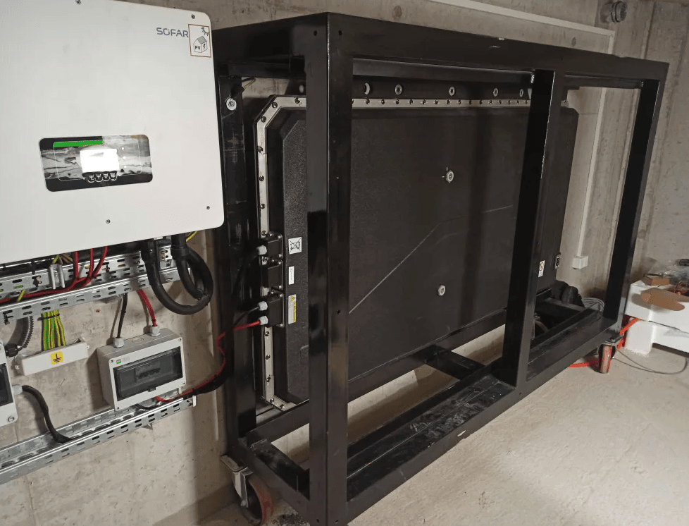
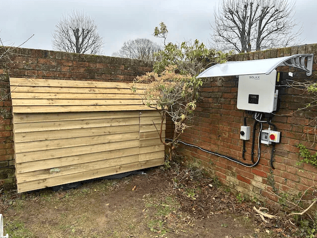
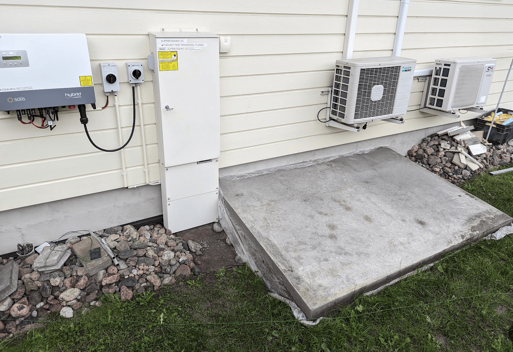
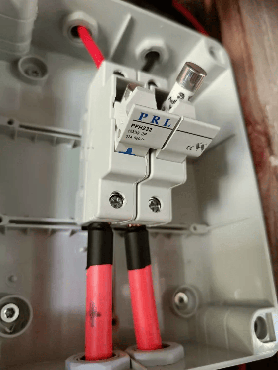
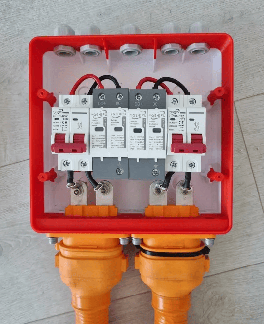
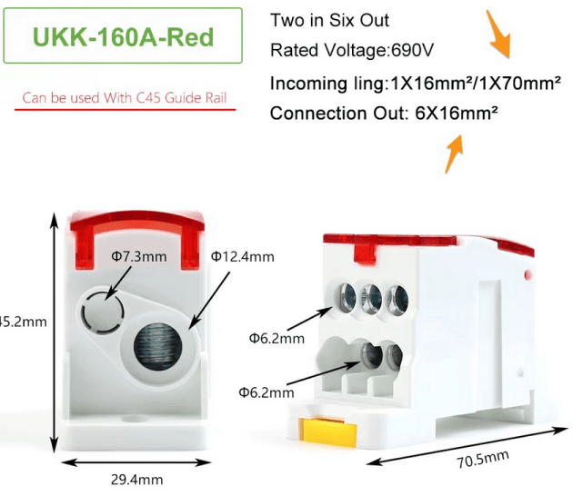
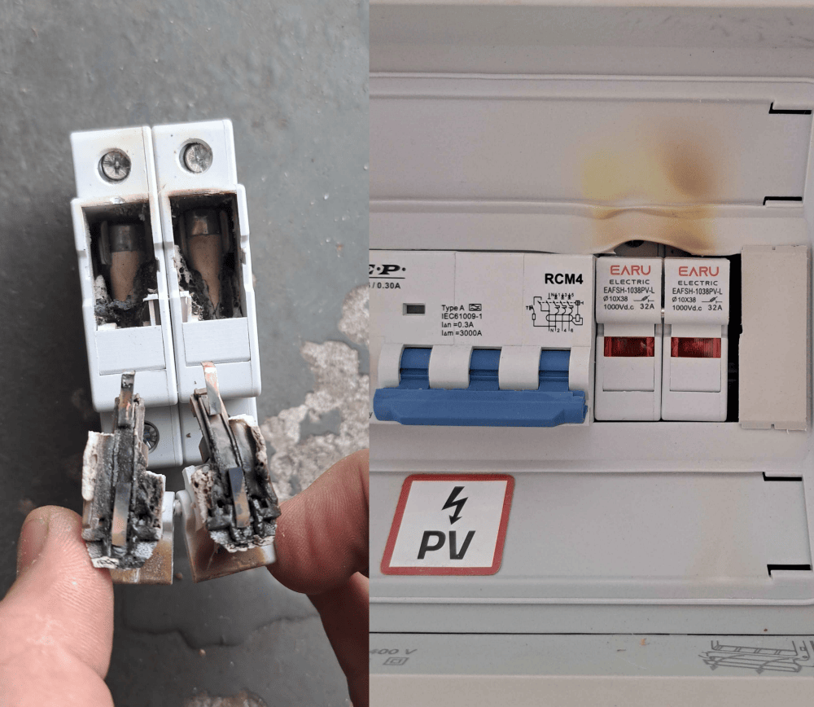
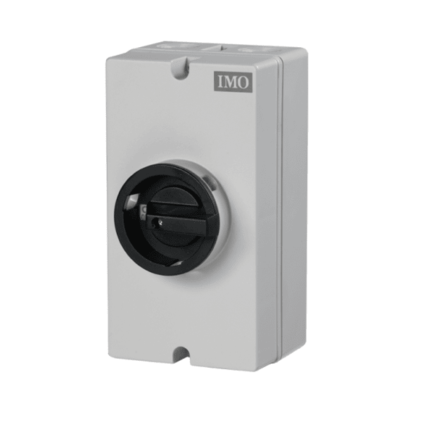
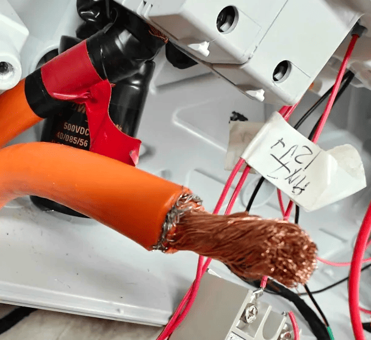
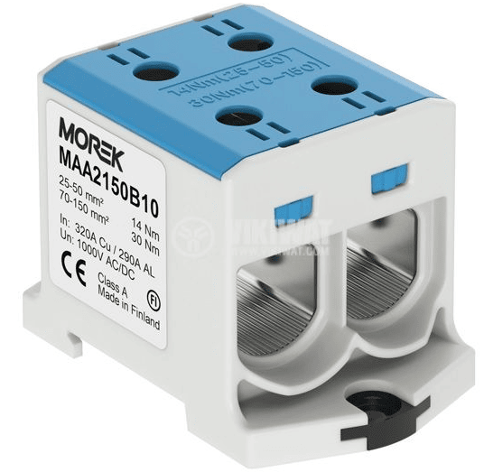

# Installation guidelines
This section will guide you towards making a safer installation of the battery. Please start by familiarizing yourself with your local regulations regarding solar inverters and stationary storage requirements. Make sure the inverter selection is approved by your grid operator before ordering parts. Finally, make sure the person installing the hardware has a valid electrical safety & installation training.

!!! warning "CAUTION"
    ***At the end of the day, you alone are responsible for the system.***

## Battery placement
The most important decision to make is battery placement. Any used EV pack should always be operated in an area where a potential fire would not be of risk for human life. Almost all salvage batteries come from crashed vehicles, with an unknown history. While the Battery-Emulator and your solar inverter performs several safety checks, note that almost all checks rely on communication data, so a physical error (damaged cell casings, ruptured/leaking cells, corrosion etc.) wont be easily detectable via software.

Due to all this, it is recommended to only install batteries in the following places:

* Outside
* Detached garage
* Tool-shed
* Underground
* Shipping container

Regardless of placement, great care must be taken to avoid water getting into the battery. While most EV batteries are splash proof, they cannot cope with large amounts of water/rain. If you are installing a battery outside, construct a roof to keep the battery dry.

!!! tip "TIP"
    Batteries can often be tilted, and installed on the side of a wall to save space. To this date we have not encountered any packs that would not function in a wallmounted position!

### Keeping the temperature in check
Lithium batteries are like humans, they perform best at 20°C. Many installs will have the batteries outside or in basic sheds/shelters. This means the battery might be subject to extreme temperatures, which will affect the battery performance. Depending on your climate, this might mean -40°C, or +40°C, both being bad for battery performance/longevity.

**Hot tips** :hot_face: Many lithium battery chemistries stop taking charge/discharge at >50°C. Having the battery in direct sunlight in a hot climate like Australia can cause high temperature shutdown. This can be avoided by placing the battery in a shaded area, and/or utilizing the coolant loops found on some battery packs like Tesla batteries. For [temperate climates](https://en.wikipedia.org/wiki/Temperate_climate) this is usually not required at all. In the event that temperature cannot be maintained below 50°C, the Battery Emulator will automatically stop power transfer and raise an overheated fault event.

**Cold tips** :snowflake: The same is true for the other side of the thermometer, at low temperatures it is not possible to charge/discharge lithium batteries. This lower temperature limit depends on what chemistry is used. LFP batteries start to struggle already at <0°C, while other cells such LMO and NMC can still perform at -20°C. Simply using the battery by charging and discharging it will generate heat, and by putting the battery in an isolated space, this self-generated heat can be enough to keep the battery performing thru winter. Simply keeping the contactors engaged in a battery will consume between 10-20Watts, which is excellent for keeping some heat in it. Some batteries also contain heating elements, which will automatically turn on when it gets too cold. An example of this is the Nissan LEAF battery, which can have internal heating elements that turn on at < -17°C (provided the battery is equipped with the cold climate add-on). Other batteries like Tesla S/3/X/Y has coolant loops, which you can run a heated loop thru in order to keep the battery warm during the winter. A simple space heater can also be used to keep a battery shed heated during the winter. If the battery gets too cold, <-25°C ,the Battery Emulator will automatically stop power transfer and raise a battery frozen fault event.

#### Keeping the Battery-Emulator cooler
While on the topic of temperatures, it is also important to keep the hardware running the Battery-Emulator cool. The ESP32 CPU used in all hardware solutions will start to have Wifi issues if the chip gets too hot (at around 85-95°C), and if the CPU continues to heat up towards its maximum rating it will lock up and crash (at around 125°C). This temperature measurement works great on ESP32-S3 chips, but the older ESP32 is notorious for having poorly calibrated CPU temperature. So verify with external thermometer!

**ESP32 tips** :thermometer: Mounting the Battery-Emulator hardware inside a small plastic case can lead to overheating if the ambient temperature is high enough. If you experience wifi issues, and notice high CPU temperatures, the following steps can be taken to reduce temperatures and improve stability;

1. Disable Access Point. Connecting the Battery-Emulator directly to your home wifi instead of using an AP will keep the CPU cooler!
2. Disable ESPNow if you don't use it. ESPNow, just like Access Point, increases CPU temperature significantly!
3. Open the lid / drill some ventilation holes if possible. Only do this if the enclosure is not exposed to water!
4. You can also mount a small heatsink to the CPU. RAM heatsinks make for great makeshift ESP32 heatsinks!
[aliexpress](https://vi.aliexpress.com/w/wholesale-Raspberry-Pi--aluminium-heatsink.html)
5. For extreme ambient temperatures (>40°C), you can further combat the overheating by mounting a fan to provide some air circulation


_Example, heatsink mounted on top of ESP32 CPU, for use in extreme ambient conditions_

## Examples of battery placement
Below are a few examples of safe battery placements. These can be used for inspiration and ideas for your build.

Example: Detached garage, vertical placement


Example: Wallmounted, with extra roofing


Example: Outside, vertical placement with waterproofing



Example: Underground concrete sarcophagus 



Example: Shipping container


## Wires and fuses
### Wire gauge (cross sectional area)
DC wire sizing is a very important part of planning your battery build. Most inverters accept 6mm² or 10mm²(check your inverter manual for more info), but most EV packs are 50mm². This creates a small problem, you will need to step down this wire size. When stepping down, it's a good idea to install fuses directly near the battery, to protect your wiring. 

Note: Since multiple people have assumed 4-way connecting blocks to be 2x2, resulting in short circuit, please make sure to double check continuity for all components before installing!

* When selecting the hardware (wires, fuses, switches), make sure they are rated for the DC voltages in your system. Hardware designed for solar will often work great with EV batteries. Do note that if you are using an 800V battery, you need to buy hardware that is capable of 1000VDC, it is not enough to go with 500VDC certification.

* Also keep in mind that longer DC cabling will cause larger voltage drops. Try to keep the DC wiring run as short as possible. 20-30meter is acceptable, but if you start to go longer distances (80m?), you will need to have a much larger cross sectional area wire to avoid power losses. For instance 10-25mm² might be required when going longer. Use a voltage drop cabling calculator suited for your country to see the correct cable sizing you need for a specific distance. To get a picture of how much loss you can accumulate over various length of Cu and Al cabling, [check out this calculator](https://docs.google.com/spreadsheets/d/1rSTNwgxBgrDaf8wo9_7r2cqsKLavUIEs/edit?usp=sharing&ouid=100957746627782596285&rtpof=true&sd=true) (ymmv, this is purely informational!). Around 1% of loss can be acceptable.
   * 12V control/signal wire has the same limitations, increase cable cross sectional area to be able to go longer distances. Use a calculator.
   * CAN communication at 500kbps is good for 100meter max!

* DC cabling should also be installed in a conduit, to avoid any external factors damaging the insulation around the wires. The conduit material can either be plastic or aluminium, depends on what's typical in your region.

* Avoid installing communication wires next to high voltage wiring, in order to avoid signal interference. Keep 300mm distance between AC / DC / CAN cabling at all times when possible to avoid interference.

!!! warning "CAUTION"
    Verify polarity of HV system before wiring it to the inverter. Many EV batteries don't have markings which side is +/-, so doing a test run without the inverter connected is a good idea to ensure polarity. Incorrect polarity will destroy your system.

Example, 50mm² cable stepped down to 10mm², and at the same time fused off with a 25A solar DC ceramic fuse



Example, two EV battery inputs stepped down to 10mm² using DC fuses



If you just want to step down the wire size (from 50mm² cable to 10mm² cable), you can use a terminal block such as [UKK 160](https://www.aliexpress.com/item/1005007537314525.html)

{ width="630" height="546" }

### DC Fuses

#### How large fuse do I need?
Sizing your fuse depends on your target power (kW) and your battery's voltage *range* — not its nominal voltage.

Inverters draw constant **power**, so as the battery discharges and its voltage falls, the **current rises** to compensate. The highest current always occurs at the lowest battery voltage. A fuse sized using nominal or full-charge voltage will be undersized, and may nuisance-blow during long discharges at low state of charge.

**Always use the lowest voltage your battery will reach** (minimum cell voltage × number of cells in series) for the calculation. 
```
Example voltage range assessment
Zoe ZE40 is "96s" — 96 cells in series. Each lithium cell has a safe working window, typically 3.0V minimum to 4.2V maximum:
Pack minimum: 96 × 3.0V = 288V 
Pack maximum: 96 × 4.2V = 403V
```
Then add ~25% overhead, because a fuse's effective rating drops at high ambient temperature — a 25A fuse in a warm enclosure may not reliably carry 25A and may fatigue if run continuously near their rated current.
```
Example calculation, 5kW inverter with a Nissan LEAF battery (96s, 300–400VDC range rounded)
Current at full charge:  I = P/U = 5000W / 400V = 12.5A
Current at empty:        I = P/U = 5000W / 300V = 16.6A  ← sizing point
Fuse size = 16.6A × 125% ≈ 20A fuse required
```
Note the spread: the same 5kW load draws 33% more current at the bottom of the voltage range than at the top. The wider your battery's voltage range, the bigger this effect. If your fuse blows occasionally during long, high-power discharges, this is the most likely cause — recheck the calculation using your true minimum pack voltage.

The fuse must not be used as your current limiter. Set the inverter or Battery Emulator max discharge current *below* the fuse rating (≤80% is a good rule) so the fuse only acts on genuine faults. Fuses can either be DC Ceramic, or DC DIN-mounted fuses. Make sure the fuse you are purchasing is certified for DC and for the voltage range of your battery. 

!!! warning "CAUTION"
    Polarized DC breakers should not be used. These are only intended for solar DC, with one direction of current flow. If these are used on batteries that have bi-directional current flow, they will break. For this reason, gBat fuses are recommended!

[DF Electric PMX Fuse Holders](https://www.dfelectric.es/products/pmx-fuse-holders/)

[DF Electric 14x51 2-40A 600V DC fuses](https://www.dfelectric.es/products/cyl-gbat-fuse-links-600v-dc/14x51-cylindrical-gbat-fuse-link-600v-dc/)

[DF Electric 22x58 40-80A 600V DC fuses](https://www.dfelectric.es/products/cyl-gbat-fuse-links-600v-dc/22x58-cylindrical-gbat-fuse-link-600v-dc/)

Don't buy cheap products from AliExpress unless you intend to burn your house down (images courtesy of WJD on Dala's EV Discord);

{ width="1000" height="868" }

#### Disconnect switches
Some countries have legislation that dictate a need for DC disconnect switches (also known as DC isolation switch). The idea behind this is that these switches will be installed in a place where first responders and firefighters can easily turn off your solar/battery combination. Check your local legislation to see if this is required in your area.

{ width="600" height="600" }

[IP67 Waterproof 32A 1000V Disconnect Switch](https://imopc.com/imo_uk_gbp_view/enclosed-dc-switch-ip66-6249d58eb8c4a.html)

### Protective earth
The battery case **needs** to be connected to protective earth (PE). This is required for a few technical and safety reasons;

* Signal integrity. Having the battery case sit at earth potential avoids any ground loops thru communication shield wires.
* CAN transceiver longevity. Failure to attach PE to battery case can damage CAN bus systems from ground loops thru shield wires
* Isolation testing. Your inverter will periodically test how safe the high voltage system is by measuring insulation resistance between HV+/- to PE. If the battery case is left freefloating and not connected to PE, any HV leaks might go unnoticed. 
* If you are in a country that requires a residual current device in your electrical panel (GFCI/RCD), these also need to be able to accurately measure any DC leakage to PE and trip

!!! warning "CAUTION"
    **Failure to connect battery case to protective earth can lead to dangerous situations where high voltage leaks are not detected**

Example, Nissan LEAF battery case connected to PE


### Loss of isolation :zap: 
If either HV+ or HV- touches protective earth while the system is running, the solar inverter will detect this and throw an loss of isolation / insulation resistance too low error message, and stop operation. Troubleshooting this can be tricky, and requires extreme caution since high voltage can be present in protective earth.

Example, wire shielding cut too close to copper, making the shield touch HV-. This was causing inverter to stop operation

{ width="608" height="558" }

Start by checking the easy stuff, measure if HV wiring is leaking to PE. If the wiring is OK, the battery itself can also have an internal leak. These are much harder to diagnose compared to external wiring issues. Checkout this video for more example of leakage to ground [youtube](https://www.youtube.com/watch?v=00eEj_EgMas)

#### Optional stuff!

!!! tip "TIP"
    You can also add an [equipment stop button](../software/equipment_stop.md) to the Battery-Emulator, to make it easier to stop the system.

[IP67 1NO1NC Stop Switch](https://vi.aliexpress.com/item/1005008119829541.html)

[Resistor kit](https://vi.aliexpress.com/item/1005006699173023.html)

# Periodic maintenance :wrench: 
While EV batteries are designed to be low-maintenance, periodic checks are crucial for ensuring long-term reliability, maximizing performance, and guaranteeing safety. A proactive maintenance schedule can prevent costly failures and identify potential issues before they become serious hazards.

The information below is general guidance.

!!! warning "CAUTION"
    De-energize and isolate the system from all power sources (AC and DC) before performing any physical maintenance, and only qualified personnel should perform these tasks.

## Software update :cd: 
Perform periodic [over the air software updates](../software/ota_update.md) to the Battery-Emulator board. Pay extra attention to the [release notes](https://github.com/dalathegreat/Battery-Emulator/releases), and if you see an improvement concerning the components you are using, update the system. If you see changes concerning Safety, also update the system right away.

- Frequency: Check every 2-3 months if updates are available

## Terminal tightness :nut_and_bolt: 
Electrical connections can loosen over time due to thermal cycling (expansion and contraction from heating and cooling during charge/discharge cycles). This is especially noticeable on high power DC systems. A loose connection increases electrical resistance, leading to localized heating, potential fire hazards, and voltage drops that reduce system efficiency.

- **Why it's Important:** Loose terminals are a leading cause of electrical failures. They can cause arcing, melting, and in severe cases, fires.
- Materials Matter:
   - **Copper Lugs/Terminals:** Check torque every 1-2 years.
   - **Aluminium Lugs/Terminals:** Aluminium is more susceptible to "cold flow" or creep under pressure. Check torque annually.
- Procedure:
   - **Safely de-energize the system** and verify there is no voltage present with a known working multimeter
   - **Use a calibrated torque wrench** and the correct socket.
   - **Consult your manufacturer's manual for the exact torque specification** (e.g., 4-5 Nm or 35-45 in-lbs). On some terminals the torque value is stamped directly on them. Do not over-tighten, as this can strip threads or damage terminals.
   -Visually inspect terminals for signs of corrosion, melting, or discoloration.

{ width="536" height="523" }

Example of terminal with torque values printed on it

## Coolant (for Liquid-Cooled Systems) :sweat_drops:

Liquid cooling is used in some EV batteries to manage battery temperature. Maintaining the coolant is vital for thermal management and preventing corrosion.

- **Why it's Important:** Low coolant levels can lead to poor heat dissipation, causing the battery to overheat and degrade rapidly. Old coolant loses its anti-corrosive properties, leading to leaks and cooling system blockages.
- Coolant Level Check:
   - Frequency: Check every 3-6 months.
   - Procedure: With the system off and cool, inspect the coolant reservoir. The level should be between the "MIN" and "MAX" marks. Top up only with the manufacturer-recommended coolant type. Never mix different coolants.

- Coolant Replacement:
   - Frequency: Typically every 3 to 7 years, but follow the manufacturer's strict interval.
   - Procedure: This is often a very installation specific task. It involves draining the old coolant, flushing the system, and refilling with new, premixed coolant while ensuring all air is bled from the lines to prevent airlocks.

## State of Health (SOH) and efficiency :battery:
EV batteries provide valuable data that is part of a digital maintenance routine.

- Why it's Important: Tracking SOH and cell balance helps predict system lifespan and identify abnormal performance drops that may indicate a failing cell or module.
- Procedure:
  - Monthly: Open the Battery-Emulator Webserver. Check for any active fault codes or warnings. Tip, if the LED on the Battery-Emulator is Green, no Warnings/Errors are active.
   - Bi-monthly: Record key metrics like:
      - State of Health (SOH): The battery's capacity relative to its original state.
      - Cell balance: The better a battery is balanced, the more energy you can safely extract from it. Keep a track of the deviation in mV, by visiting the Cellmonitor page.

## Visual Inspection :eyes: 
A simple visual check can reveal many early warning signs.

- Frequency: Monthly.
- What to Look For:
   - EV battery case: Signs of corrosion, damage, or water ingress.
   - Cabling: Fraying, cracking, chew marks from pests, or signs of overheating (discoloration).
   - General Area: Ensure the area around the battery is clean, dry, and free from flammable materials.